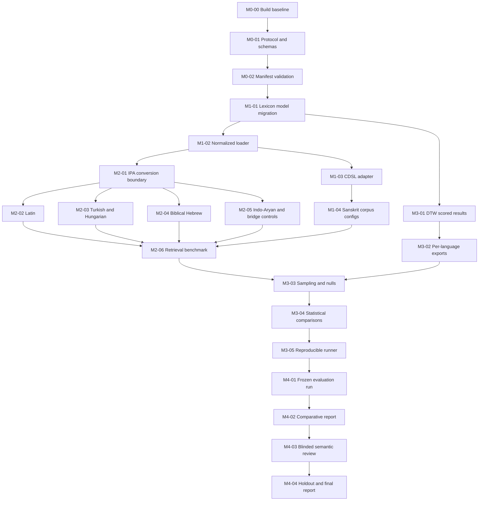

# Milestone Pull Request Specifications

<!-- markdownlint-disable MD036 -->

This document turns the milestones in the
[improvement plan](improvement-plan.md) into reviewable pull requests. The PRs
are ordered by dependency, but PRs that share only a completed prerequisite may
be developed in parallel. A PR must not include the work assigned to a later PR
merely because the adjacent code is convenient to change.

## Conventions for every PR

Every PR description must contain:

- the milestone and PR identifier from this document;
- a one-paragraph statement of the behavior or research capability added;
- links to its prerequisite PRs and upstream data/tool versions;
- a list of generated or changed artifacts;
- commands used to build, test, validate data, and regenerate outputs;
- test results and data-quality counts before and after the change;
- licensing/provenance effects, including a statement when there are none;
- known limitations and explicitly deferred work;
- a checklist mapping the implementation to every acceptance criterion below.

All generated files must be deterministic for fixed inputs, configuration, and
seed. Sort records before serialization, write invariant-culture numbers, use
UTC ISO 8601 timestamps only in metadata that is excluded from content hashes,
normalize line endings, and never depend on filesystem enumeration order.

Third-party data must not be committed unless its redistribution terms have
been reviewed. Tests use small, attributed fixtures that are either synthetic,
public domain, or permitted by the source license. Full acquisition is an
explicit command and writes under a gitignored raw-data directory.

The core library remains compatible with `netstandard2.0` until a dedicated
compatibility decision changes it. Tests must run on a supported .NET SDK; no PR
may require the unsupported `netcoreapp2.0` runtime without documenting and
automating that requirement.

## Dependency map

## Milestone 0: Protocol and manifests

### M0-00: Establish a supported build and test baseline

**Purpose:** make a fresh checkout buildable and testable on .NET 10 before
research behavior changes.

**Scope**

- Pin the .NET 10 SDK and its roll-forward policy in `source/global.json`.
- Set `net10.0` and shared compiler/analyzer behavior in
  `source/Directory.Build.props`; remove per-project target framework values.
- Enable NuGet central package management in
  `source/Directory.Packages.props`, move every package version there, and
  remove package versions from individual projects.
- Convert both test projects to `MSTest.Sdk`, pin its SDK version in
  `global.json`, and use Microsoft Testing Platform as the test runner. Remove
  the legacy test SDK, adapter, framework, and Visual Studio service entries
  that `MSTest.Sdk` replaces.
- Remove compatibility package references supplied by .NET 10, including
  `System.Dynamic.Runtime` and `System.ValueTuple`.
- Keep analyzers and nullable flow analysis enabled. Record pre-existing
  diagnostic codes in a temporary `WarningsNotAsErrors` migration baseline so
  unrelated warning categories remain build-breaking; do not disable analyzers
  or warnings-as-errors globally.
- Convert `source/Enochian.sln` to `source/Enochian.slnx`, preserve all project
  and solution-item membership, and remove the old solution file.
- Add one repository-level build/test command to the README or a script/task.
- Add CI for restore, build, and both test projects on Windows. A second Linux
  job is desirable because acquisition and deterministic serialization must be
  cross-platform, but it may be deferred if current path handling prevents it.
- Capture the pre-existing test count and identify any skipped or
  environment-dependent integration test.

**Tests**

- `dotnet build source/Enochian.slnx` succeeds from a clean restore.
- All existing unit and integration tests are discovered and run.
- A clean checkout CI job exercises the same commands documented for local use.

**Acceptance criteria**

- All six projects target `net10.0` through shared build properties.
- The .NET and MSTest SDK versions are pinned and governed by an explicit
  roll-forward rule.
- Individual project files contain no package version numbers.
- The SLNX solution contains the same projects and solution items as the former
  SLN solution.
- The build reports legacy baseline warnings but fails for warning codes outside
  the documented baseline.
- CI and local commands agree on test discovery and pass/fail status.
- Any pre-existing failure is documented and separately tracked, not silently
  ignored or converted to a passing assertion.

**Out of scope:** broad dependency upgrades unrelated to .NET 10 compatibility,
code formatting, feature changes, and data acquisition.

### M0-01: Freeze the research protocol and define schemas

**Purpose:** create machine-readable contracts for the experiment before
comparative results can influence analysis choices.

**Scope**

- Add a versioned experiment configuration schema covering corpus split,
  transcription and mapping versions, tokenization, feature set, DTW settings,
  length filters, lexicon filters, seeds, sample counts, planned contrasts,
  correction method, and output locations.
- Add a versioned source-manifest schema covering source ID, language/family,
  URL, commit/tag/release, retrieval date, checksum, license/SPDX expression,
  citation, parser version, raw path, and generated artifact path.
- Add a versioned normalized-entry schema with the fields specified in the
  improvement plan. Define required fields, enums, nullability, Unicode form,
  and ID construction.
- Check in an exploratory config and a confirmatory protocol template. The
  confirmatory template must name an evaluation partition and a holdout
  partition without including results.
- Write inclusion/exclusion rules for uncertain Voynich tokens, minimum and
  maximum phoneme lengths, proper names, abbreviations, duplicate forms, parts
  of speech, and inflected forms.
- State the primary statistic and contrasts in machine-readable fields and prose.

**Interfaces and artifacts**

- `experiments/schemas/experiment.schema.json`
- `resources/lexicons/schemas/source-manifest.schema.json`
- `resources/lexicons/schemas/normalized-entry.schema.json`
- `experiments/exploratory.example.json`
- `experiments/confirmatory.protocol.json`
- protocol documentation explaining every non-obvious field

Names may be adjusted to existing conventions, but schema IDs and versions must
be stable once released.

**Tests**

- Valid example documents pass schema validation.
- Fixtures fail for missing version, missing checksum, unknown entry kind,
  invalid language code, unspecified random seed, and overlapping evaluation
  and holdout partitions.
- JSON serialization round-trips without losing fields.

**Acceptance criteria**

- A reviewer can determine exactly which data and analysis choices are frozen.
- Evaluation and holdout loci are disjoint and selected without comparative
  language scores.
- Schema versions are present in every instance and unknown major versions fail
  with a useful error.
- No actual language-comparison output is added.

**Out of scope:** downloading sources, parsing dictionaries, matching, and
statistical implementation.

### M0-02: Validate manifests, checksums, and licenses

**Purpose:** make source provenance and redistribution constraints executable
rather than informal notes.

**Scope**

- Add a manifest validator available from the console application or a small
  repository tool.
- Validate schema, URL, pinned revision, SHA-256 format, local checksum when a
  file exists, unique source IDs, and allowed license expressions.
- Add initial manifests for CDSL MW/AP/PWG/PW/SHS, RomLex, UniMorph candidates,
  Perseus, Zemberek, Magyar Ispell, BHSA, and Open Scriptures. A manifest may be
  marked `planned` until an exact artifact and checksum are acquired.
- Add explicit distribution policy values such as `vendored`,
  `download-on-demand`, and `metadata-only`.
- Mark BHSA as optional/non-commercial and prevent it from being bundled by the
  default acquisition/package path.
- Add an attribution report generated solely from manifests.

**Tests**

- Reject checksum mismatch, duplicate source ID, floating `main`/`master`
  revision, absent license, and a non-commercial source marked for default
  bundling.
- Generate a stable attribution report from fixture manifests.
- Validate all checked-in manifests without network access.

**Acceptance criteria**

- A fresh checkout validates all metadata-only and fixture manifests offline.
- Every planned source has an owner, upstream location, license status, and
  distribution policy; unresolved terms are visibly `unverified` and block
  bundling.
- Validation failures identify the manifest and field.
- The PR contains no unreviewed full dictionary data.

**Milestone 0 exit:** the build is reproducible, schemas are validated, the
protocol records the primary analysis before results exist, and every source has
an auditable distribution decision.

## Milestone 1: Sanskrit expansion

### M1-01: Migrate the lexicon model and cache safely

**Depends on:** M0-02.

**Purpose:** represent provenance and duplicate lemmas without breaking cache
loading or existing RomLex/SHS/CMU flows.

**Scope**

- Extend `LexiconEntry` with stable entry ID, language, family, source ID,
  source record ID, form, entry kind, dialect, part of speech, frequency,
  source encoding, and IPA. Define which fields are optional.
- Replace the one-to-one `EntriesByLemma` contract with a one-to-many index.
  Preserve a compatibility helper only if existing callers require it, and
  define deterministic ordering for homographs and multiple pronunciations.
- Version the binary cache format. Old caches must be rejected and rebuilt,
  never partially read as the new shape.
- Include source/config identity in the cache key so two dictionaries with the
  same filename cannot collide.
- Open cache files with truncating semantics and write atomically through a
  temporary file to prevent stale trailing bytes or interrupted cache files.
- Update existing lexicon loaders to populate stable defaults for new fields.

**Tests**

- Round-trip every entry field through the binary cache.
- Load duplicate lemmas and retrieve all records in stable order.
- Reject the old magic/version and rebuild from source.
- Verify cache isolation for equal filenames in different paths.
- Verify interrupted/invalid caches do not replace a valid cache.
- Run existing CMU, RomLex, SHS, and flow tests.

**Acceptance criteria**

- Duplicate lemmas no longer throw during cached loading.
- Existing sample configurations continue to run without edits.
- Cache invalidation is deterministic and logged.
- Public API changes and migration instructions are documented.

**Out of scope:** generic normalized files, new dictionary parsers, score changes.

### M1-02: Add the normalized lexicon loader and quality report

**Depends on:** M1-01.

**Purpose:** make source adapters emit one format that the C# library can load
without source-specific parsing logic.

**Scope**

- Implement a streaming JSON Lines loader for the normalized-entry schema. TSV
  may be added later only if profiling demonstrates a need.
- Normalize configured textual fields to NFC while retaining source spelling.
- Convert `ipa` through the existing IPA encoding into Enochian feature vectors.
- Reject or quarantine invalid records without silently deleting unknown
  graphemes or IPA segments.
- Emit a deterministic machine-readable quality report containing total,
  accepted, rejected, unique lemma/form/phonology counts; duplicate counts;
  rejection reasons; unknown symbols; and phoneme-length histogram.
- Add configuration fields for manifest path and quality-report output.

**Tests**

- Fixtures cover NFC/NFD equivalence, duplicate IDs, duplicate lemmas, multiple
  pronunciations, unknown IPA, malformed JSON, absent required fields, and empty
  phonology.
- Quality-report counts exactly match fixture expectations.
- Loading the same fixture twice yields byte-identical reports and entry order.
- A large synthetic fixture is streamed rather than loaded as raw text at once.

**Acceptance criteria**

- Every rejected record has a source ID/line and reason.
- Unknown IPA is a counted validation failure, not a zero vector or omitted
  segment.
- Loader and report behavior are documented with a minimal flow example.
- No external acquisition tool is required to run tests.

### M1-03: Add a pinned CDSL acquisition and normalization adapter

**Depends on:** M1-02.

**Purpose:** transform the selected Cologne dictionaries into normalized,
validated artifacts through one shared adapter.

**Scope**

- Add an acquisition command that checks out or downloads the exact `csl-orig`
  commit recorded in manifests and verifies checksums.
- Parse canonical `v02/<dict>/<dict>.txt` records for MW, AP, PWG, PW, and SHS.
  Share headline/record parsing; isolate dictionary-specific markup handling.
- Extract source record ID, SLP1 headword, display form where available, and
  definition. Preserve raw headword and dictionary ID.
- Convert SLP1 with the existing encoding and also emit canonical IPA so the
  normalized loader follows the same path as other languages.
- Emit one normalized JSONL and one quality report per source.
- Record adapter version and exact transform command in generated metadata.

**Tests**

- Commit small attributed fixtures for every selected dictionary, including
  alternate headwords, homographs, markup, malformed records, and an SLP1 edge
  case.
- Snapshot expected normalized records and quality counts.
- Cross-check fixture SLP1 conversions against the existing SHS loader.
- An acquisition test using local fixture archives runs offline; network tests
  are opt-in and do not gate ordinary unit tests.

**Acceptance criteria**

- One command can acquire and normalize all five pinned sources.
- Dictionary-specific rules are documented and do not leak into the generic
  loader.
- No unknown SLP1/IPA segment remains without a reviewed allowlist entry and
  rationale.
- Full raw sources remain uncommitted unless license review explicitly approves
  vendoring.

### M1-04: Configure and verify the Sanskrit corpus panel

**Depends on:** M1-03.

**Purpose:** expose the new dictionaries to flows and construct a deduplicated
Sanskrit view without treating overlapping dictionaries as independent data.

**Scope**

- Add example lexicon configurations for MW, AP, PWG, PW, and normalized SHS.
- Add a deterministic union builder that preserves source memberships while
  deduplicating by normalized phonological form and, secondarily, lemma.
- Define primary filters for entry kind, phoneme length, and malformed markup.
- Produce an aggregate report with per-source counts, overlap matrix, union
  counts, and exclusion reasons.
- Compare legacy and normalized SHS counts and explain every discrepancy above
  a predeclared tolerance.
- Add a small Sanskrit integration flow that searches each lexicon separately.

**Tests**

- Union fixtures prove that overlapping records collapse once while retaining
  all source IDs.
- Output does not change when source input order changes.
- Integration test loads all fixture lexicons and identifies their source in
  returned entries.
- Legacy/normalized SHS comparison test uses a committed miniature fixture.

**Acceptance criteria**

- Reports distinguish per-dictionary evidence from union evidence.
- Duplicate handling is deterministic and documented.
- Full-corpus quality reports have zero unexplained unknown symbols.
- Existing `samples/voynich.json` behavior is preserved or migrated with a
  documented before/after comparison.

**Milestone 1 exit:** all selected Sanskrit dictionaries pass fixture tests and
quality checks, can be run independently, and can be combined without inflating
overlap.

## Milestone 2: Multilingual control panel

### M2-01: Define the IPA conversion-provider boundary

**Depends on:** M1-02.

**Purpose:** make external and custom grapheme-to-phoneme conversion
reproducible without linking Python/GPL tooling into the core library.

**Scope**

- Define a conversion artifact containing source form, normalized form, IPA,
  provider ID/version, profile ID/version, status, and diagnostics.
- Add an external preprocessing command contract: UTF-8 input, deterministic
  JSONL output, nonzero exit on incomplete batches, and a machine-readable
  summary.
- Add profile metadata for Epitran and custom converters. Pin package/tool
  versions and preserve generated IPA in normalized artifacts.
- Add an IPA audit command that reports unknown segments and samples records by
  length and unusual grapheme for human review.
- Define a blinded review-sheet format with hidden language/source columns and
  fields for expected IPA, accept/reject, error category, and notes.
- Do not call Python or a network service while loading a lexicon at runtime.

**Tests**

- Round-trip conversion and review-sheet fixtures.
- Reject missing provider versions, unconverted characters, empty IPA, and
  unknown segments.
- Verify stable blinded IDs and that hidden metadata cannot be inferred from
  row order.

**Acceptance criteria**

- Every IPA string can be traced to a versioned provider/profile and source
  form.
- Runtime matching consumes frozen artifacts only.
- GPL tools, if used, execute out of process and their outputs/provenance are
  clearly separated from library licensing.

### M2-02: Add the Latin control

**Depends on:** M2-01.

**Purpose:** add a historical Indo-European control from a non-Indo-Aryan branch.

**Scope**

- Pin the Perseus Lewis and Short TEI component and record its component-level
  license; optionally use UniMorph Latin only for the separate inflected-form
  analysis.
- Add a TEI adapter that emits unique lemma records, POS, definitions, IDs, and
  source provenance.
- Implement a versioned Classical Latin phonological profile. Document choices
  for `c/g`, `v/u`, `i/j`, `qu`, `x`, Greek loans, vowel length, and stress.
- Exclude records whose pronunciation depends on unavailable vowel length from
  the primary analysis, or define and predeclare a conservative ambiguity rule.
- Produce quality and G2P audit reports.

**Tests**

- TEI fixtures cover nested senses, homographs, orthographic variants, and Greek
  text.
- A curated pronunciation fixture covers every multi-character and contextual
  rule.
- Unknown grapheme and ambiguous-length behavior is explicit and counted.

**Acceptance criteria**

- The run uses one named pronunciation convention only.
- Definitions do not influence inclusion or phonological conversion.
- At least 100 stratified forms are prepared for blinded review before Stage A.

### M2-03: Add Turkish and Hungarian controls

**Depends on:** M2-01. Turkish and Hungarian adapters may be separate commits
inside one PR only if they share the same Epitran integration and review process;
otherwise split this into M2-03a and M2-03b.

**Purpose:** add Turkic and Uralic controls with relatively transparent
orthographies.

**Scope**

- Pin Zemberek `master-dictionary.dict` and Magyar Ispell source/release.
- Parse lexical stems and morphological metadata without expanding all
  productive inflections.
- Exclude proper names, abbreviations, obsolete items, and malformed records
  according to the frozen policy; report each category.
- Generate IPA with pinned Epitran `tur-Latn` and `hun-Latn` profiles.
- Preserve Epitran output and conversion diagnostics in normalized artifacts.
- Produce separate quality reports and 100-item stratified blinded review sets
  for each language.

**Tests**

- Turkish fixtures cover dotted/dotless `i`, circumflexes, soft `g`, apostrophe
  boundaries, and lexicon attributes.
- Hungarian fixtures cover digraphs/trigraphs, long vowels, geminates, compound
  boundaries, and affix flags.
- Exclusion fixtures prove proper names and abbreviations cannot enter primary
  lemma sets.

**Acceptance criteria**

- Lemma counts are not inflated by generated morphology.
- Unknown grapheme/IPA rates and review accuracy satisfy the protocol threshold
  or block the language from confirmatory use.
- Source licenses and selected Magyar Ispell license option are recorded.

### M2-04: Add the optional Biblical Hebrew control

**Depends on:** M2-01.

**Purpose:** add a Semitic control while preserving the non-commercial and
optional nature of BHSA.

**Scope**

- Implement BHSA/Text-Fabric export as a separate acquisition adapter that the
  default build and test path does not require.
- Export unique lexemes with vocalized form, gloss, frequency/rank, source ID,
  and phonological representation from BHSA/`phono` when available.
- Pin the data version and cite DOI `10.17026/dans-z6y-skyh` in manifests and
  generated attribution.
- Add a CC BY 4.0 Open Scriptures or vocalized UniMorph fixture path for ordinary
  tests; do not claim it is equivalent to BHSA.
- Document treatment of matres lectionis, niqqud, shewa, dagesh, begadkefat,
  gutturals, and historical pronunciation convention.
- Ensure package/publish commands cannot include BHSA data by default.

**Tests**

- License-policy test blocks BHSA from default bundling.
- Vocalized fixtures cover ambiguous and silent marks, multiple readings, and
  Aramaic records.
- Frequency aggregation from token occurrences to unique lexemes is verified.
- Missing optional BHSA data produces a clear skip/status, not a failed build.

**Acceptance criteria**

- Biblical Hebrew is labelled as such in every artifact and report.
- Every pronunciation choice is versioned and auditable.
- A fresh checkout passes without BHSA; a documented opt-in path validates an
  authorized local snapshot.
- At least 100 stratified forms are prepared for blinded review.

### M2-05: Add modern Indo-Aryan and Indo-Iranian bridge controls

**Depends on:** M2-01.

**Purpose:** test whether any effect is specifically Indo-Aryan rather than only
Sanskrit/Romani, Indo-Iranian, or a property of one script.

**Scope**

- Select a predeclared modern Indo-Aryan panel from UniMorph based on available
  unique lemmas, script/G2P support, and license. Prefer Hindi plus at least two
  of Bengali, Marathi, Punjabi, Gujarati, Assamese, or Bhojpuri.
- Select Persian or Pashto as the non-Indo-Aryan Indo-Iranian bridge control.
- Record source quality notes and use only unique lemma columns in the primary
  analysis; keep inflected forms in separately named artifacts.
- Generate IPA with pinned Epitran profiles where supported. A language without
  an adequate converter remains `exploratory` and cannot enter the frozen panel.
- Preserve script, transliteration when used, and IPA as separate fields.
- Produce per-language quality reports and blinded review samples.

**Tests**

- UniMorph fixtures validate lemma/form/feature parsing and prove forms are not
  accidentally promoted to primary lemmas.
- Indic fixtures cover combining marks, virama, inherent vowels, nukta, and
  normalization.
- Perso-Arabic fixtures cover omitted vowels and records that must be excluded
  for uncertain phonology.

**Acceptance criteria**

- Language selection follows documented thresholds rather than observed
  Voynich scores.
- Primary and inflected-form datasets cannot be confused by IDs or paths.
- Each confirmatory language passes the same unknown-symbol and blinded-review
  thresholds as unrelated controls.

### M2-06: Implement the cross-language retrieval benchmark

**Depends on:** M1-04 and M2-02 through M2-05.

**Purpose:** validate the matching and conversion machinery on known answers
before running Voynich comparisons.

**Scope**

- Add deterministic stratified sampling of held-out entries by language,
  phoneme length, and defined unusual-grapheme categories.
- Implement versioned degradation profiles for deletion, feature merger, and
  feature masking. Profiles must be language-neutral unless a separate analysis
  is explicitly labelled.
- Compute recall@1, recall@5, recall@20, mean reciprocal rank, and normalized
  distance with and without the exact source entry in the candidate set.
- Emit per-language, per-length-band, and aggregate tidy results.
- Ingest completed blinded G2P review sheets and compute accuracy plus error
  categories; freeze the pass threshold before seeing Voynich comparisons.

**Tests**

- Synthetic identity data achieve perfect retrieval before degradation.
- A planted noisy fixture has expected deterministic ranks and metrics.
- Removing the source entry actually excludes all IDs for that source record.
- Sampling is stable for a fixed seed and changes for a different seed.
- Metric tests cover ties, no candidates, and multiple pronunciations.

**Acceptance criteria**

- Every confirmatory language passes the predeclared G2P and retrieval
  thresholds in every required length band.
- Failures block progression or downgrade the language to exploratory status;
  thresholds are not relaxed after inspecting Voynich results.
- Benchmark outputs contain no definitions or language-identifying information
  in blinded review files.

**Milestone 2 exit:** at least one Latin, Turkish, Hungarian, Biblical Hebrew,
bridge, and multi-language Indo-Aryan dataset has reproducible phonology and
passes the known-language benchmark, or is explicitly excluded before the
confirmatory experiment.

## Milestone 3: Scored comparative runner

### M3-01: Return DTW cost, path, and normalization

**Depends on:** M1-01. It may proceed in parallel with most Milestone 2 PRs.

**Purpose:** preserve the numerical evidence currently discarded by
`DTWMatcher`.

**Scope**

- Add a DTW result type with accumulated cost, selected path length, input
  lengths, and optional path/backpointer data for diagnostics.
- Preserve the current distance-only API as a compatibility wrapper.
- Define tie-breaking among insertion, deletion, and match so path length is
  deterministic.
- Implement mean-path normalization and mean-input-length normalization.
- Define behavior for empty sequences, invalid feature dimensions, overflow,
  tolerance boundaries, and non-finite element distances.
- Add numeric distance and normalization fields to match options/results without
  changing the existing HTML's default presentation in this PR.

**Tests**

- Hand-calculated matrices verify cost and path length for identity,
  insertion, deletion, and ties.
- Symmetry and zero-identity properties are tested where applicable.
- Existing DTW test vectors retain their raw costs.
- Empty/invalid input behavior is explicit and tested.

**Acceptance criteria**

- Existing callers compile and existing matching tests pass.
- Every returned match can expose raw and normalized cost.
- Normalization formulas and tie-breaking are documented.

### M3-02: Match and export every lexicon independently

**Depends on:** M3-01.

**Purpose:** replace pooled top-N output with auditable per-language candidate
results while retaining the interactive report path.

**Scope**

- Add a scored record with configuration ID, query ID/text/phoneme length,
  lexicon/source/language/family, candidate ID/lemma/form/phoneme length, raw
  cost, path length, normalized costs, and within-lexicon rank.
- Run top-N independently for each configured lexicon. Pooled display may remain
  as a derived view, never the only stored result.
- Export deterministic JSONL and RFC 4180 CSV using invariant culture and stable
  ordering.
- Keep definitions in a separate joinable artifact or optional column that is
  disabled for blinded quantitative runs.
- Include schema and software/config hashes in export metadata.

**Tests**

- A two-lexicon fixture returns N candidates from each, even when one language
  has uniformly lower raw scores.
- CSV quoting, Unicode, nulls, numeric precision, ties, and stable order are
  covered.
- Blinded export contains no definition or source-language leak beyond fields
  explicitly required for statistical grouping.

**Acceptance criteria**

- The same config and inputs produce byte-identical data rows.
- Every displayed result traces to an exported scored record.
- Existing `MatchReport` remains usable or has a documented migration.

### M3-03: Add balanced sampling and sequence nulls

**Depends on:** M2-06 and M3-02.

**Purpose:** control dictionary size, phoneme length, inventory, and repeated
Voynich tokens before inferential statistics.

**Scope**

- Build unique-lemma primary candidate sets with deterministic phonological
  deduplication and source membership retention.
- Implement equal-size sampling without replacement, stratified by phoneme
  length and optional comparable frequency bands.
- Add repeated lexicon subsampling at the largest common size and predeclared
  smaller sizes.
- Generate language-conditioned unigram and biphone pseudowords matching the
  Voynich query-length distribution.
- Add mapping-assignment shuffle and within-query phoneme-order shuffle nulls.
- Separate unique Voynich type and token-frequency-weighted analyses.
- Store seeds, generator algorithm/version, sample membership, and null ID.

**Tests**

- Sample sizes and strata match exact fixture expectations.
- No sample contains duplicate entry IDs or leaks excluded entry kinds.
- Pseudowords satisfy requested length and n-gram constraints.
- Shuffles preserve the declared invariants.
- Same seed/config produces identical membership and output; different seeds
  produce different valid draws.

**Acceptance criteria**

- No language receives more candidates than the common sample size in the
  primary comparison.
- Sampling reports expose shortages and never silently replace missing strata.
- Full-lexicon and inflected-form analyses have distinct IDs and output paths.
- Null data cannot be mistaken for observed-mapping output.

### M3-04: Implement calibrated scores and statistical comparisons

**Depends on:** M3-03.

**Purpose:** compute the predeclared family comparison with uncertainty and
multiplicity control.

**Scope**

- Convert nearest-neighbor distances to empirical null percentiles and a
  documented standardized score, handling ties consistently.
- Compute paired median differences over unique Voynich word types.
- Implement paired permutation tests, bootstrap confidence intervals over word
  types and lexicon subsamples, effect sizes, and Holm correction.
- Compute per-language winner proportions and stratified summaries by length,
  manuscript section, and frequency band.
- Require contrasts to be present in the frozen experiment config; reject
  unregistered confirmatory contrasts.
- Emit tidy estimate, interval, test, adjusted-p-value, and diagnostic tables.

**Tests**

- Compare every statistic against small hand-calculated fixtures or a second
  trusted implementation with fixed expected values.
- Cover ties, all-equal values, missing language/query pairs, one-sided versus
  two-sided alternatives, zero variance, and insufficient bootstrap samples.
- Holm tests verify monotonic adjusted values and family size.
- A planted-effect fixture is detected; exchangeable null fixtures do not show
  systematic significance across fixed regression seeds.

**Acceptance criteria**

- No test uses token occurrences as independent observations in the primary
  analysis.
- Randomization counts and confidence levels come from config and are recorded.
- Missing data and failed assumptions produce diagnostics, not fabricated zero
  values.
- All reported p-values identify whether and how they were adjusted.

### M3-05: Assemble the reproducible experiment runner

**Depends on:** M3-04.

**Purpose:** execute validation, matching, null generation, statistics, and
report inputs from one frozen configuration.

**Scope**

- Add a console command that validates schemas/manifests/checksums, verifies
  source and software versions, runs the selected stages, and writes a run
  manifest.
- Add resumable stage outputs keyed by content hash. A resumed run must verify
  inputs before reuse.
- Separate exploratory and confirmatory modes. Confirmatory mode rejects dirty
  protocol fields, unpinned sources, ad hoc contrasts, definitions in scoring
  exports, and evaluation/holdout overlap.
- Write content hashes for normalized lexicons, samples, match exports, nulls,
  statistical tables, and report inputs.
- Add an end-to-end synthetic multilingual fixture with one planted family
  signal and one null configuration.
- Document runtime/memory expectations and a small smoke-test profile.

**Tests**

- End-to-end planted signal is recovered in the expected direction and null
  fixtures are not.
- Two clean runs are byte-identical apart from explicitly non-hashed timing
  metadata.
- Changing one source checksum, seed, mapping, or filter changes the run ID.
- Interrupted runs resume only compatible stages.
- Confirmatory mode rejects every prohibited mutation listed above.

**Acceptance criteria**

- One documented command reproduces the complete synthetic analysis.
- Run manifests contain enough information to diagnose any changed output.
- No network access occurs after the acquisition/verification stage.
- Runtime exceptions identify stage, config ID, and relevant source/query.

**Milestone 3 exit:** the synthetic fixture recovers its planted signal, nulls
behave as expected, all inferential outputs are reproducible, and raw scored
records remain available for audit.

## Milestone 4: Confirmatory run and report

Milestone 4 PRs are data/research releases. They must not introduce unreviewed
algorithmic changes. Any bug discovered here is fixed in a separate PR with a
new runner version; affected runs are invalidated and repeated from the start.

### M4-01: Freeze inputs and execute the evaluation partition

**Depends on:** M3-05 and signed-off Milestone 2 quality reviews.

**Purpose:** create the immutable run bundle for the non-holdout Voynich data
without inspecting semantic definitions.

**Scope**

- Replace all planned manifests with exact artifact revisions and checksums.
- Record completed G2P review results and final language inclusion/exclusion
  decisions made under the frozen thresholds.
- Tag or otherwise identify the protocol, mapping, normalized lexicons, runner
  commit, environment, and evaluation partition.
- Execute confirmatory mode once for the evaluation partition.
- Publish the run manifest, logs, quality reports, scored records without
  definitions, sample memberships, null outputs, and statistical tables.
- Record any operational failure and rerun policy. Do not modify analysis
  settings to obtain a preferred result.

**Tests and verification**

- Re-run the smoke profile before the full job.
- Verify all output hashes and schema validations after completion.
- Reproduce a stratified sample of scored records from raw inputs independently.
- Confirm holdout loci do not appear in any query or intermediate artifact.

**Acceptance criteria**

- The repository or release points to immutable, checksummed artifacts.
- No definitions were present in scoring/review outputs available to analysts.
- Every exclusion follows a rule recorded before the run.
- The run is labelled failed/invalid rather than patched if an input or software
  defect is found.

### M4-02: Publish the comparative quantitative report

**Depends on:** M4-01.

**Purpose:** render the frozen evaluation results without changing the analysis.

**Scope**

- Add report generation from tidy outputs only; do not recompute hidden metrics
  inside templates.
- Present the primary contrast first, followed by confidence interval, effect
  size, corrected p-value, and plain-language interpretation.
- Include per-language distributions, winner proportions, length/section
  strata, lexicon-subsample stability, null distributions, and all planned
  sensitivity analyses.
- Include Stage A retrieval and G2P quality results beside comparative results.
- State exclusions, missing data, multiplicity family, and whether the primary
  decision rule was met.
- Link every table/figure to the run ID and source tidy artifact.

**Tests**

- Snapshot report tables/figure metadata against frozen fixture outputs.
- Verify displayed values match tidy tables within declared formatting precision.
- Accessibility checks cover alt text, table headers, non-color-only encoding,
  and readable static output.
- Link and artifact-hash checks run offline where possible.

**Acceptance criteria**

- Conclusions include negative or inconclusive results without selective
  omission.
- Exploratory contrasts are clearly separated from confirmatory contrasts.
- Definitions and semantic judgments remain absent.
- The report can be rebuilt without rerunning matching or statistics.

### M4-03: Conduct blinded semantic annotation

**Depends on:** M4-02.

**Purpose:** evaluate contextual gloss plausibility as secondary evidence after
phonological results are frozen.

**Scope**

- Generate an annotation packet with stable randomized candidate IDs, context,
  gloss, and predeclared label set while hiding language, source dictionary,
  phonological score, rank, and hypothesis status.
- Include candidates sampled by a rule fixed before annotation, including
  control-language candidates and negative examples.
- Require at least two independent annotators and record consent/attribution
  policy for publishing annotations.
- Compute inter-annotator agreement, adjudication status, and acceptance rates
  by language only after annotations are locked and unblinded.
- Publish the packet generator, blank template, locked responses where permitted,
  and analysis script/results.

**Tests**

- Packet tests prove hidden fields are absent and row order is seed-stable.
- Metric tests cover agreement, missing labels, abstentions, and adjudication.
- Unblinding requires a separate mapping artifact not included in annotator
  packets.

**Acceptance criteria**

- Annotation instructions do not reveal the expected language or theory.
- No annotator sees scores/ranks before responses are locked.
- Agreement and all language acceptance rates are reported, not only favorable
  examples.
- Semantic results are explicitly labelled secondary.

### M4-04: Execute the holdout once and publish the final report

**Depends on:** M4-03.

**Purpose:** test replication on untouched folios and issue the final research
bundle.

**Scope**

- Verify that holdout loci and their derived tokens have never appeared in an
  exploratory, evaluation, semantic-selection, or tuning artifact.
- Run the unchanged M4-01 protocol and runner on the holdout partition once.
- Apply the same primary contrast, correction family, thresholds, and report
  structure without refitting or selecting mappings.
- Compare effect direction and interval with the evaluation partition; report
  replication success or failure under the predeclared rule.
- Publish a final index containing protocol, manifests, licenses/citations,
  environment, commits, quality reports, evaluation and holdout run IDs,
  quantitative reports, semantic report, limitations, and reproduction steps.
- Archive or release large permitted artifacts with checksums; document the
  authorized acquisition path for non-redistributable inputs.

**Tests and verification**

- Automated leakage check over all checked-in experiment configs and run
  manifests.
- Full artifact hash and schema verification.
- Independent clean-room reproduction of at least the small profile and all
  report tables; preferably the full run when compute and source access permit.
- Verify final links, citations, licenses, and source-version statements.

**Acceptance criteria**

- No analysis or mapping change occurs between evaluation and holdout runs.
- Replication is judged by the frozen decision rule, including a negative result.
- Every published number traces to a tidy artifact and run ID.
- A researcher without BHSA can reproduce all unrestricted stages and receives
  exact instructions for the optional restricted stage.

**Milestone 4 exit:** the complete evaluation and holdout evidence is published
with provenance, uncertainty, nulls, semantic results, and enough information
for independent reproduction.

## Suggested PR labels and review ownership

Use milestone labels (`milestone-0` through `milestone-4`) plus one primary area:

| Area | PRs | Required review focus |
| --- | --- | --- |
| `build` | M0-00 | SDK support, CI, unchanged behavior |
| `research-protocol` | M0-01, M4-01, M4-04 | leakage prevention, preregistration, decision rules |
| `provenance` | M0-02, M1-03, M2-02 through M2-05 | pinned sources, checksums, licenses, citations |
| `lexicons` | M1-01 through M1-04 | parsing, Unicode, duplicates, cache compatibility |
| `phonology` | M2-01 through M2-06 | IPA accuracy, review blinding, historical convention |
| `matching` | M3-01, M3-02 | DTW correctness, ranking, export traceability |
| `statistics` | M3-03 through M3-05, M4-02 | sampling, nulls, inference, reproducibility |
| `semantics` | M4-03 | annotation blinding, agreement, secondary status |

Protocol, phonology, and statistics PRs should each receive a domain review in
addition to code review. A PR author should not be the only person signing off
on a blinded G2P sample, confirmatory protocol mutation, or semantic annotation
unblinding.
